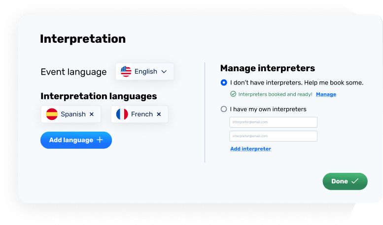

# Interpretation Manager

## How does it works ? 

The **interpretation manager** should be use to create a new event

You will have to specify the url of your event

You will have the option to choose between **booking our interpreters** or using yours. See the section [managing interpreters](/interpreters/index)
