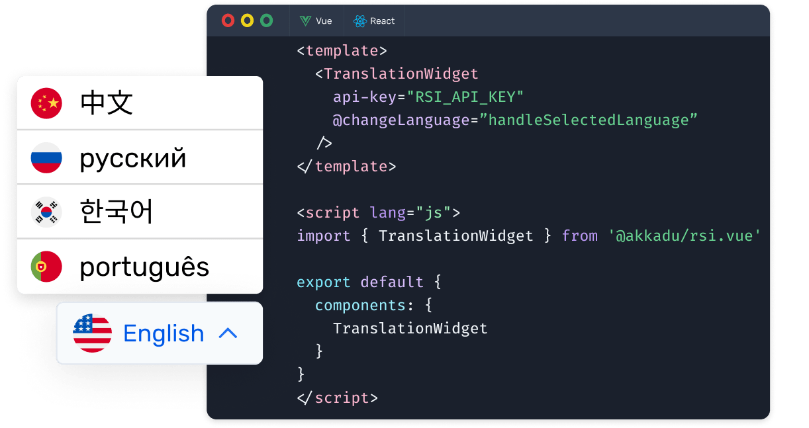

# Interpretation PLayer

## How does it works ? 

The **interpretation player** should be use by the user of your event to switch between the languages of interpretation.

## Stream and Virtual Platform User's Event page
  