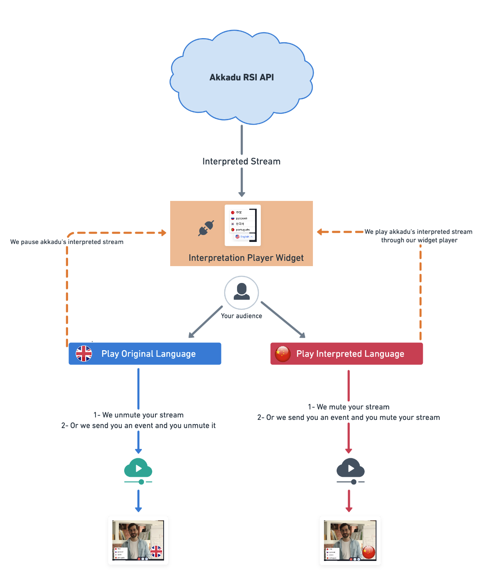

# Interpretation PLayer

## How does it works ? 

The **interpretation player** should be used by the audience of your event to switch between the different languages of interpretation.
## Stream and Virtual Platform User's Event page
  