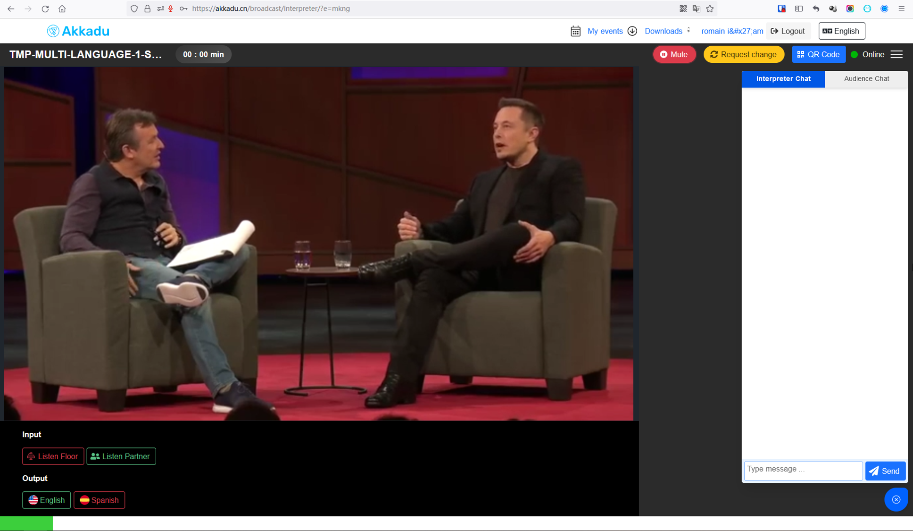
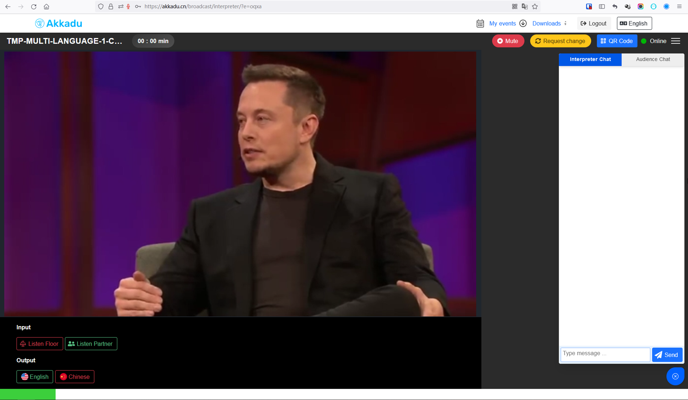

# Interpretation Player Demo

 
<iframe width="560" height="315" src="https://www.youtube.com/embed/GE4_qnR43I0" title="YouTube video player" frameborder="0" allow="accelerometer; autoplay; clipboard-write; encrypted-media; gyroscope; picture-in-picture" allowfullscreen></iframe>
 
 

### Prerequisite:

You want to test our demo-beta, contact us by email at :`alvaro@akkadu-team.com` and provide us with:
- **origin**. The origin of the website you will use for your demo. Example : `www.your-website.com`
- **m3u8 stream url**. One stream URL in m3u8 format that you will use for the demo.
  - 🚨 The stream must be using **HTTPS** 

We will then send you : 
- a demo **sdkKey**: xx_sdk_key
- a **roomName** : abcd

- An **interpreter demo account**:
  - username
  - password
  - login link

 
 

**Origin** : This demo will only work on the website you provided us as **origin**

**roomName** : For additional info about the **roomName** you can check this [page](/interpretation-player/roomname)

 
 

### Let's Start

Choose your framework and install our `interpretation player` :
- [Vanilla Javascript Doc](/getting-started/vanilla-js.html#registering-the-interpretation-player)
  - Vanilla Javascript [Demo repo](https://github.com/Akkadu/rsi-widgets/tree/main/packages/rsi-vanilla-example)

- [ReactJs Doc](/getting-started/react.html#registering-the-interpretation-player)
  - React Js [Demo repo](https://github.com/Akkadu/rsi-widgets/tree/main/packages/rsi-react-example)

- [VueJs Doc](/getting-started/vue.html#registering-the-interpretation-player)
  - VueJs [Demo repo](https://github.com/Akkadu/rsi-widgets/tree/main/packages/rsi-vue-example)

   
   

  ### Example for three languages

  <video src="https://assets.akkadu.com/akkadu-rsi-widget/assets/test-musk-speech.mp4" width="95%" controls="true" autoplay="false" ></video>
 
 

**Interpretation Platform - Spanish**
 

 
 

**Interpretation Platform - Chinese**
 

