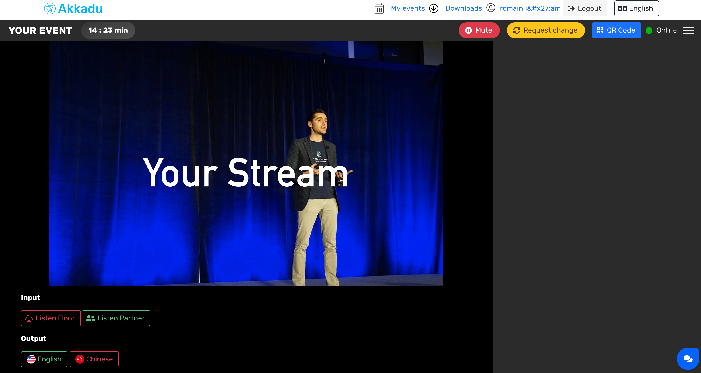

# Interpreters

## Managing the interpreters

Your client can invite its own interpreters or book from our database.

### Using own interpreters
Each interpreter will have access to an interpreter account. Your client can invite them by adding their email to the [interpretation manager](/interpretation-player/index) when creating an event.

### Booking our interpreters
Your client can book from our +5K professional interpreters database.

## Where will the interpreters interpret?
The interpreters will interpret on our interpreter pages, in akkadu.com.
We will provide them some credentials, and they will be able to access to all their events.

## External Stream
When creating an event, you will provide us an external stream that the interpreter will see when interpreting.

We are currently supporting : 
* RTMP
* m3u8
* Youtube URL
* Vimeo URL